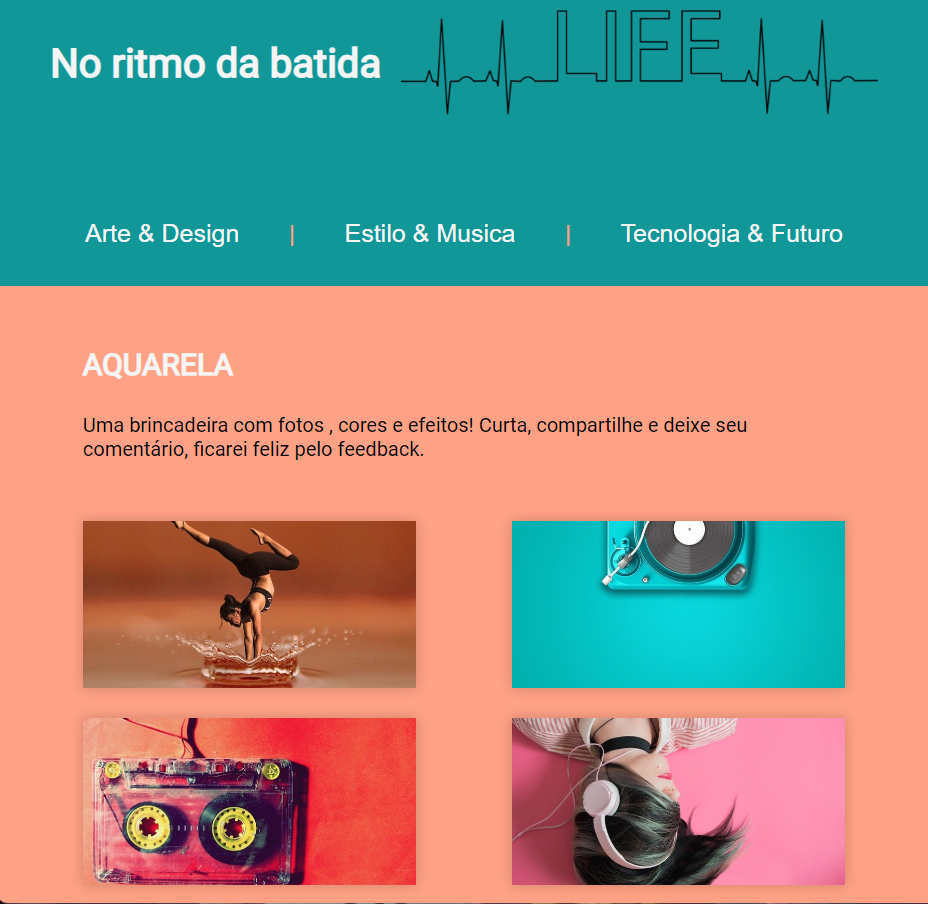
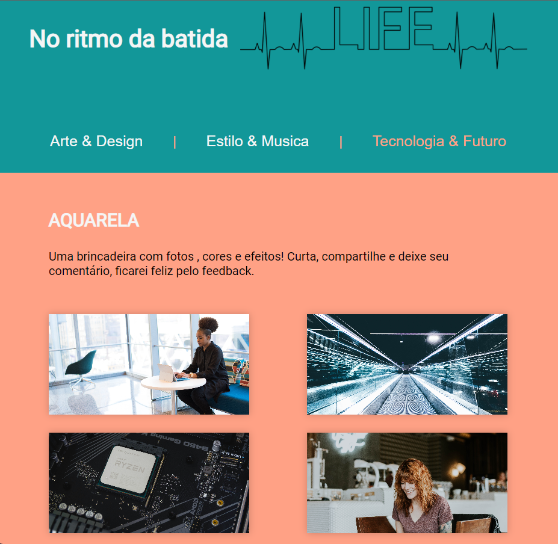

<h1 align="center">Desafio 3 do Vai na Web 📓</h1>

> Este projeto inicialmente foi uma dinâmica realizada em uma das aulas do Vai Na Web, a fim de aprimorar o trabalho em grupo ao repoduzir o layout dado pelo professor no tempo estimulado. Por fim, ele se tornou o desfio da semana.

> Durante o desenvolvimento, aproveitei a oportunidade para entender na prática o uso de APIs, utilizando a API oferecida pelo <a href="https://unsplash.com/developers" target="_blank">Unsplash</a> como minha primeira cobaia!

  

  <a href="https://pdleal.github.io/vaiNaWeb_desafio3/"> Live Demo</a>
